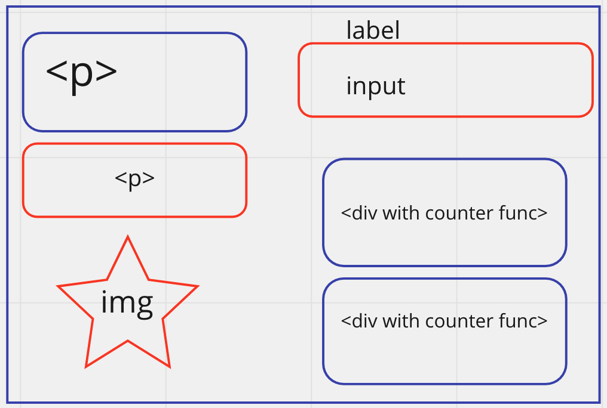

# Wire frame for planning

Plan
HTML elements (page load)
• Input for adding new goblins with a button) => form
• Span for tracking new goblins
• Span for tracking goblin hp
• Goblin list (div el)

State
• Array of goblins (object with id, name hp)
• Number of defeated goblins
• Adventurer hp
• currentID (in order to create new goblins with ids)
Events
• Each goblin is clickable
• On click...
◦ Possible decrement the goblins hp
◦ Possibly decrement the adventurer hp
◦ Possibly increment the defeated goblins
◦ Update the DOM with new goblin and adventurer hp and defeated goblin state
• New goblin form (on submit)
◦ User supplied name & submit form
◦ Make new goblin object
◦ Add object the goblin array
◦ “Update list display”
• Clear out the list DOM
• Loop through the goblins
• Render a new goblin element for each item
• Append each el to the container element (going to be using a for loop)
Functions
• displayGoblins- clear out the list and render the goblin el for each item
• renderGoblin(goblin)- create a goblin el for the specific goblin object
• goblinClickHandler - take care of the game logic when the goblins are clicked

Slices

1. Rendering the goblins list to the page
2. From to create new goblins (render to page)
3. Gamification (resulting impacts to HP on user clicks)
